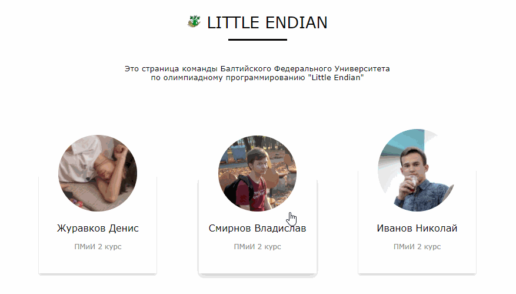

# Lesson 6
Практика **JavaScript**

Открытие карточки с полной информацией по клику

## Зависимости
* `Node.js`

## Запуск
* Склонировать себе проект
* Выполнить в директории команду `npm install` для подключения Node.js
* Запустить локальный веб-сервер командой `npm start`
* Перейти по адресу `localhost:4000`
